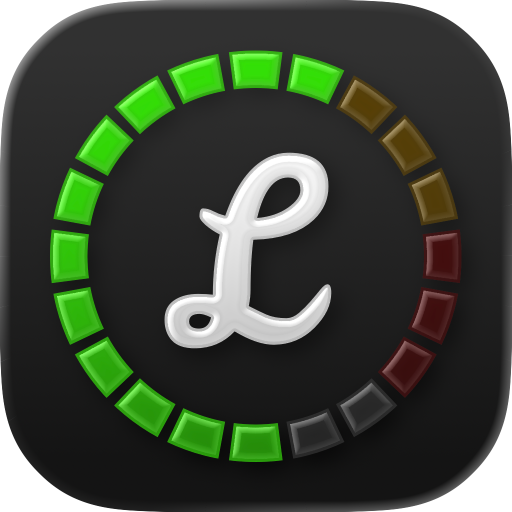

# Lufsy

[](https://github.com/kapoko/lufsy/actions/workflows/build.yml)
[](https://github.com/kapoko/lufsy/actions/workflows/release.yml)

Loudness Broadcast Norm Analyser.

Lufsy is a native macOS loudness checking app that analyzes audio/video files with bundled FFmpeg and validates them against multiple delivery norms.

## [Download](https://lufsy.koman.app)

Downloads are available from the project website: [lufsy.koman.app](https://lufsy.koman.app)

## Supported norms

- `EBU R128`
- `ATSC A/85`
- `ARIB TR-B32`
- `Streaming (YouTube/Spotify)` (`-14 LUFS`)
- `Podcasts` (`-16 LUFS`)

Each profile checks integrated loudness plus true peak, with profile-specific targets/tolerances. Some profiles also enforce a loudness range (LRA) limit.

## How it works

- Add files by drag-and-drop or with the `+` toolbar button.
- Analyses run concurrently.
- Switching the norm dropdown re-evaluates existing measured files instantly (no re-scan needed).

## Build and run

```bash
swift run
```

### Beta update channel

Enable beta updates. Used for testing releases.

```bash
defaults write app.koman.lufsy updates.beta.enabled -bool true
# or false
```
